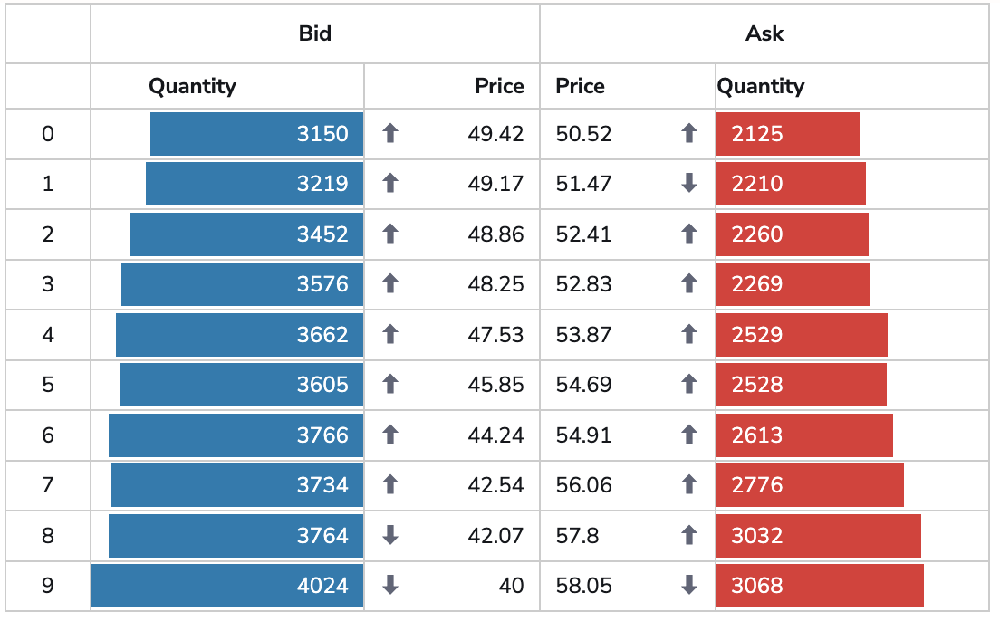

# Market Depth exercise

The code in this repository is the starting point for this training exercise.

## Getting the code

Clone the repository and enter its top-level folder:

```bash
git clone https://github.com/heswell/cbf-market-data.git
cd cbf-market-data
```

If you use Visual Studio Code, install the
[Biome extension](https://marketplace.visualstudio.com/items?itemName=biomejs.biome)
for in-editor formatting and lint feedback.

Your task is to replace the placeholder in
`src/components/market-depth/MarketDepthFeature.tsx` with a market-depth
component that renders the same live tabular data as the table above it. Use
[`public/market-depth.png`](public/market-depth.png) as the visual reference.

> **What is Market Depth?**
>
> A trading exchange's order book records outstanding buy orders (bids) and sell
> orders (offers) for an instrument at each price. Market depth shows how much
> quantity is available on each side of that book. Level 1 data shows only the
> best bid and best offer. Level 2 data shows the aggregated available quantity
> at multiple price levels on both sides of the book. Level 3 data includes the
> individual orders that make up those levels, typically with order-level detail
> for participants. This component displays Level 2 data.



The finished component should present the top 10 price levels of market depth.
It must remain connected to the existing live data source: quantity bars should
grow and shrink as quantities update, and direction arrows should change between
up and down as prices move.
Test data is already provided with exactly the data you need, and you can see it
rendered in a regular Vuu table when you run the app.

## Running the application

From the top-level folder of this repository (the folder containing
`package.json`), install dependencies and start the Vite development server:

```bash
npm install
npm run dev
```

`npm run dev` starts Vite's local development server and prints the URL to
open, normally `http://localhost:5173`. Keep this command running while you
work.

Vite uses hot module replacement (HMR), which updates the running application
when you save a source file. You can edit files under `src/` and see the change
in the browser automatically, without manually rebuilding or restarting the
app, as long as the development server is running.

Other useful commands:

```bash
npm run format       # format source files with Biome
npm run format:check # check formatting without changing files
npm run lint         # run Biome lint rules
npm run build        # type-check and create a production build
npm run preview      # serve the production build locally
```

## How the starter application works

The application uses React, TypeScript, Vite, and Vuu. `src/main.tsx` loads the
Vuu styles, creates the React root, and wraps the application in
`TestDataProvider`.

`TestDataProvider` uses Vuu's `LocalDataSourceProvider`. Importing
`src/data/algo-module.ts` registers the local `ALGO` module, which exposes the
`prices` table. This simulates the behaviour of a Vuu server. No server is
required for this exercise.

The source table is defined in `src/data/pricesTable.ts`:

- `generateMarketDepth('VOD.L')` creates the initial rows.
- `MarketDataGenerator` updates those rows every 250 ms after a consumer
  subscribes.
- The schema in `src/data/algo-schemas.ts` defines the columns: `bid`,
  `bidQuantity`, `level`, `offer`, `offerQuantity`, `symbol`, and
  `symbolLevel`.

`src/components/prices-table/PricesTable.tsx` is an example consumer. It obtains
Vuu's `VuuDataSource` constructor with `useData()`, creates a data source for
`ALGO/prices`, and renders it with Vuu's `Table`. The table has zebra stripes
and column separators enabled in its `TableConfig`.

`src/App.tsx` places the Vuu `Shell` around the app. The initial workspace is
described by `src/layoutJSON.ts`, which registers and arranges the table and
the `MarketDepthFeature` placeholder in vertically resizable views.

## Implementing the market-depth component

Start in `src/components/market-depth/MarketDepthFeature.tsx`. The component
should use the existing `ALGO/prices` data rather than duplicating or polling
the generator. `src/components/market-depth/useMarketDepthData.ts` provides a
`useMarketDepthData` hook that subscribes to this table and returns sorted
`MarketDepthRow` values for the component to render.

Suggested approach:

1. Use the supplied `useMarketDepthData` hook to receive live rows and re-render
   when updates arrive.
2. Start by calling the `useMarketDepthData` hook and logging the result with
   `console.table`.
3. Limit the display to the first 10 levels and render bid and offer quantities,
   prices, and directional indicators.
4. Derive each quantity bar's width from its quantity relative to the largest
   visible quantity. Do not hard-code widths.
5. Retain the previous bid and offer prices in component state or a ref so each
   update can be classified as up, down, or unchanged before selecting the
   arrow treatment.
6. Add component-scoped styles alongside the feature and use the image as the
   guide for spacing, colour, typography, alignment, and bar layering.
7. Once you are done, feel free to remove the table or rearrange the layout as
   you see fit. The exercise is all about the `MarketDepth` component.

While developing, keep the existing table in place: it is the easiest way to
inspect the live rows and verify that the new component represents the same
data. The feature should handle its initial loading state and avoid assumptions
about a fixed update cadence.

## Tooling overview

| Tool | Role |
| --- | --- |
| [Vite](https://vite.dev/) | Development server, hot module replacement, and production bundling |
| [TypeScript](https://www.typescriptlang.org/) | Static type checking during `npm run build` |
| [React](https://react.dev/) | Component rendering and state management |
| [Vuu](https://vuu.io/) | Data-source context, live table subscriptions, layout shell, table, icons, and theme |
| [Salt](https://salt-ds.com/) | Design-system primitives used by Vuu |
| [Biome](https://biomejs.dev/) | Source-code formatting and linting |

The dependencies are locked in `package-lock.json`. Use `npm install` so your
local environment matches the exercise configuration.
